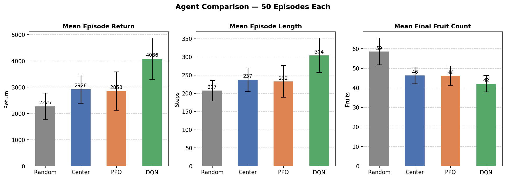
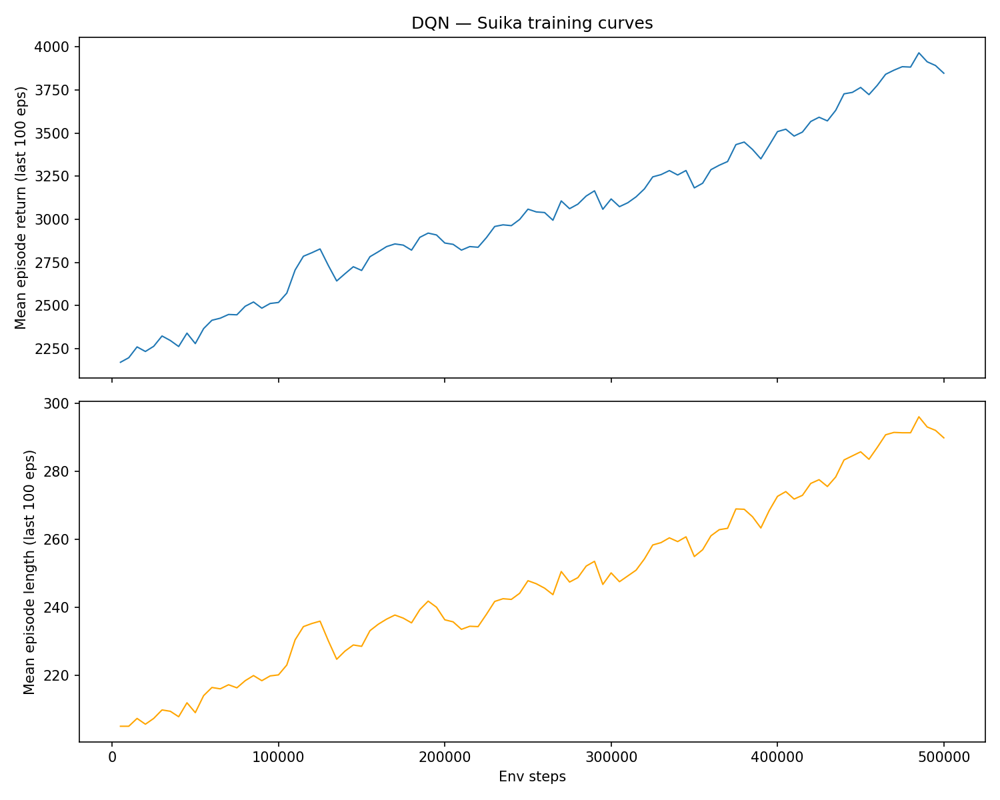
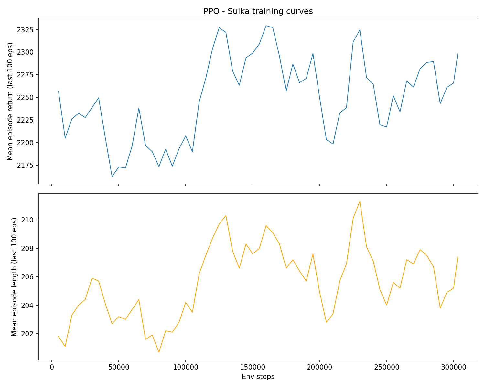

# RL Fruit Game

Suika-style fruit merging implemented as a custom Gymnasium environment, with DQN, PPO, random, and center-drop agents for comparison.

## What It Does

The environment simulates a turn-based Suika puzzle game: the agent chooses one of 32 drop columns, physics resolves, matching fruits merge into larger fruits, and the episode ends when the stack crosses the danger line, with rewards based on merge score only. This project applies deep reinforcement learning to that setting, following the approach pioneered by Mnih et al. (2015) in playing Atari games from raw state — the central question is whether an agent can discover non-trivial strategies such as fruit-size differentiation and merge targeting purely from reward signal, without hand-coded heuristics. A custom Gymnasium environment was built from scratch so that both a custom DQN and a library PPO (Schulman et al., 2017) could be trained and compared under identical conditions.

## Quick Start

```bash
uv sync
uv run pytest tests/ -v
uv run python scripts/play_human.py
```

Human controls: arrow keys move the drop column, space drops the fruit. See `SETUP.md` for training and evaluation instructions.

## Video Links

- **Demo video (3-5 min):** [Watch on YouTube](https://youtu.be/x3xDY4vmC5w)
- **Technical walkthrough (5-10 min):** [Watch on YouTube](https://youtu.be/f5qnqIoays8)

## Evaluation

Each agent was evaluated for 50 complete episodes with the same environment and metrics. Episode return is the total RL reward collected from fruit merges. Final score is the game score at termination; in this environment it matches episode return because reward is based on merge score. Episode length measures how many fruit drops the agent survived, and final fruit count measures how crowded the board was at the end.

| Agent | Mean Return | Mean Score | Mean Episode Length | Mean Final Fruits |
|---|---:|---:|---:|---:|
| Random | 2274.84 +/- 505.99 | 2274.84 +/- 505.99 | 207.28 +/- 28.07 | 58.62 +/- 6.85 |
| Center | 2927.92 +/- 539.35 | 2927.92 +/- 539.35 | 237.22 +/- 32.41 | 46.40 +/- 4.26 |
| PPO | 2858.44 +/- 734.62 | 2858.44 +/- 734.62 | 232.34 +/- 43.60 | 46.18 +/- 4.93 |
| DQN | 4085.60 +/- 786.88 | 4085.60 +/- 786.88 | 304.30 +/- 47.39 | 42.14 +/- 4.18 |

DQN was the strongest method in the final evaluation. It scored about 79.6% higher than the random baseline and about 39.5% higher than the center-drop heuristic. It also survived longer, averaging 304.30 drops per episode compared with 237.22 for center, 232.34 for PPO, and 207.28 for random. The lower final fruit count suggests that DQN produced more successful merges and kept the board less crowded.

The center baseline was surprisingly competitive, outperforming random and slightly outperforming PPO. This shows that a simple stable-stacking heuristic is already useful in this environment. PPO improved over random, but it did not beat the center heuristic under the current training setup. The training curves in `results/dqn/learning_curve.png` and `results/ppo/learning_curve.png` show the same pattern: DQN had a clear upward trend in return, while PPO remained much flatter.

**Qualitative analysis.** Watching each agent play reveals behaviors consistent with the numbers. The random agent drops chaotically, frequently placing fruit on top of already-tall columns and almost never triggering merges intentionally. The center agent stacks methodically and keeps the board balanced, but has no merge strategy beyond hoping adjacent fruits happen to match.

DQN shows clear learned structure. It differentiates fruit size: smaller fruits tend to be placed near the edges where they are less likely to interfere with the center of the board, while larger fruits are dropped in the middle where they are more likely to encounter matching fruits and merge. Drop positions are diverse across the board width, and DQN does not collapse into the center-stacking strategy despite center outperforming random. The primary failure mode is that aggressive merging leaves small unmerged fruits trapped at the bottom of the stack. These fruits cannot be reached later in the episode, gradually reducing the usable board space. This long-horizon consequence is difficult for DQN to learn given the sparse, delayed nature of the penalty. It likely explains DQN's higher return variance (±787) relative to center (±539): most episodes DQN merges well and scores high, but when the trapped-fruit pattern accumulates early, the episode collapses.

PPO shows signs of failure to converge. It repeatedly drops fruits in nearly the same location — typically slightly right of center — regardless of what is already on the board. It does not differentiate between fruit sizes or types, treating every drop decision identically. Fruits dropped in this pattern frequently land on top of existing stacks rather than targeting merges, and the board fills up faster than with any other trained agent. This matches the flat learning curve in `results/ppo/learning_curve.png` and its score sitting below even the center heuristic.

Agent comparison (mean ± std, 50 episodes each):



Training curves:





## Individual Contributions

Completed individually by me.
